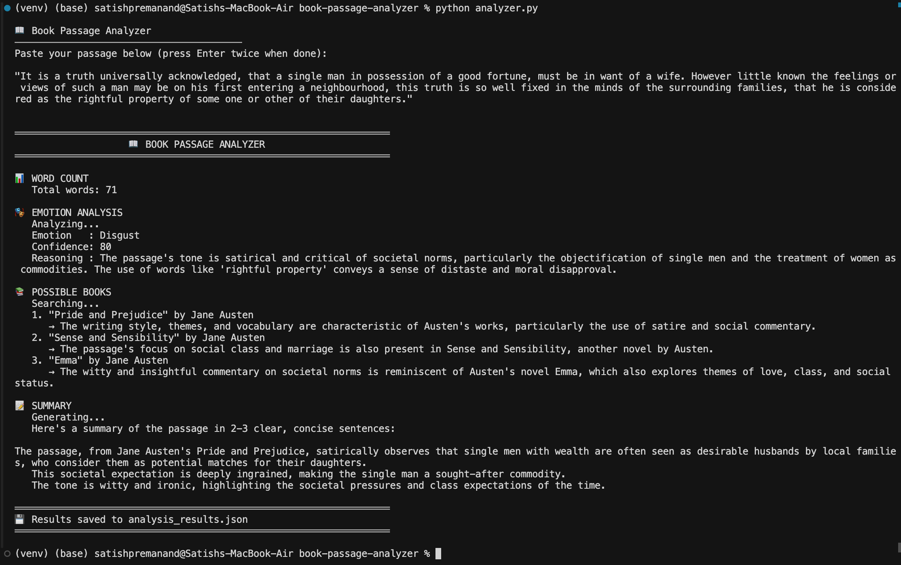
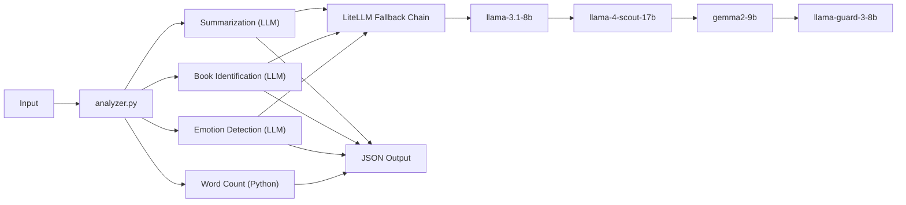

# Book Passage Analyzer

A Python script that analyzes book passages. Give it any excerpt and it returns the word count, detected emotion, possible source books, and a summary.

---

## Setup

Prerequisites: Python 3.8+ and a free Groq API key ([console.groq.com/keys](https://console.groq.com/keys) — no credit card needed).

```bash
git clone https://github.com/yourusername/book-passage-analyzer.git
cd book-passage-analyzer

python -m venv venv
source venv/bin/activate   # Windows: venv\Scripts\activate

pip install -r requirements.txt

cp .env.example .env
# Add your key: GROQ_API_KEY=gsk_your_key_here
```

## Usage

```bash
python analyzer.py                         # Interactive — paste your passage
python analyzer.py "Your passage here"     # Direct input
python analyzer.py --file passage.txt      # Read from file
```

---

## Output

### Interactive Mode



### CLI Argument


### File Input


---

## Architecture



Input comes in through any of the three modes. Word count is pure Python — no reason to call an LLM for arithmetic. Emotion detection, book identification, and summarization each make a focused LLM call with a structured prompt. If a model is rate-limited or unavailable, LiteLLM automatically falls through to the next one in the chain.

---

## Why LiteLLM

I needed a way to call LLMs without coupling the code to a single provider. LiteLLM gives me one `completion()` function that works across 100+ providers. Switching from Groq to OpenAI or Anthropic is a string change, not a rewrite.

It also handles fallback natively — I define a list of models, and if one is down, it moves to the next. No retry logic to write, no error handling boilerplate. The entire LLM layer is about 15 lines of code.

I considered LangChain but it's heavy for what this needs. I considered raw SDKs but then I'd lose provider flexibility. LiteLLM is the thinnest abstraction that still gives real benefits.

## Why Groq

Three reasons: it's free, it's fast, and it takes under a minute to set up.

- **Free** — No credit card, no trial expiry, no surprise bills. Anyone reviewing this project can run it immediately at zero cost.
- **Fast** — Groq runs on custom LPU hardware built for inference. Responses come back in milliseconds. Since this tool makes 3 sequential LLM calls, that speed difference is felt.
- **Simple** — Sign up, copy key, paste in `.env`. No cloud console configuration, no IAM roles, no billing setup.

And because I'm using LiteLLM, Groq isn't a hard dependency. It's a prefix in a model string. If requirements change, switching providers takes one line.

---

## Design Decisions

**Why LLM over traditional NLP?**

Word count doesn't need AI — `len(text.split())` is fine. But emotion detection with VADER gives you positive/negative/neutral at best. I needed nuanced emotions like melancholy, unease, or wonder. Book identification would require a vector database and curated corpus. Summarization with extractive methods just picks existing sentences. An LLM handles all three tasks better with less infrastructure.

**Why a single script?**

The scope doesn't warrant a package structure. `analyzer.py` is ~300 lines, readable top-to-bottom, with no import chains to trace. Clean code doesn't require over-engineering.

---

## Project Structure

```
book-passage-analyzer/
├── analyzer.py          # Main script
├── requirements.txt     # 3 dependencies
├── .env.example         # API key template
├── .gitignore
├── LICENSE
├── images/              # Screenshots
│   ├── Interactive.png
│   ├── CLI Argument.png
│   └── File Input.png
└── test/                # Sample passages
    ├── test_1984.txt
    ├── test_great_gatsby.txt
    └── test_pride_and_prejudice.txt
```

## Dependencies

| Package | Purpose |
|---------|---------|
| `litellm` | Unified LLM interface with fallback |
| `groq` | Groq SDK (used by LiteLLM under the hood) |
| `python-dotenv` | Loads API key from `.env` |

## Testing

```bash
python analyzer.py --file test/test_1984.txt
python analyzer.py --file test/test_great_gatsby.txt
python analyzer.py --file test/test_pride_and_prejudice.txt
```

## Sample Output

```json
{
  "passage": "It was a bright cold day in April...",
  "word_count": 42,
  "emotion": {
    "emotion": "unease",
    "confidence": "88%",
    "reasoning": "The juxtaposition of 'bright cold day' with surveillance imagery creates a sense of..."
  },
  "possible_books": [
    {
      "title": "1984",
      "author": "George Orwell",
      "reason": "The dystopian imagery and omnipresent surveillance theme strongly suggest..."
    }
  ],
  "summary": "The passage describes a bleak urban setting under constant surveillance, establishing a tone of oppression and conformity."
}
```

---

Satish Prem Anand — May 2026

License: MIT
